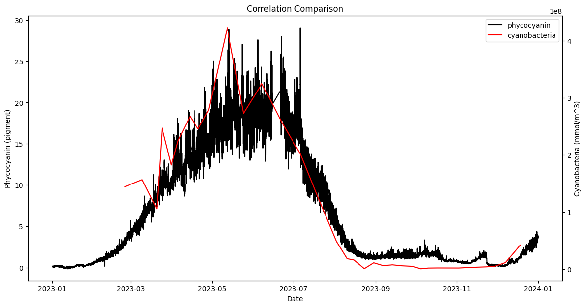

# MARVL Conversion (Phytoplankton Biomass)

| Name | MASTER KEY Variable ID | Units | Model_TFV Variable ID | Model_TFV Variable Name | Model_TFV TFV Variable Name |
| ------------- | ------------- | ------------- | ------------- | ------------- | ------------- |
| Chlorophyte | var00753 + (var00636 + ... + var00677) | cells/mL --(x275)--> mmol/m3 | var00038 | Phytoplankton Biomass (greens) | WQ_PHY_GRN |
| Picoplankton | var00694 + var00695 + var00710 + var00713 + var00756 | cells/mL --(x275)--> mmol/m3 | var00779 | Phytoplankton Biomass (pico) | WQ_PHY_BGA |
| Diatom (Bacillariophyta) | (var00609 + ... + var00622) | cells/mL --(x200000)--> mmol/m3 | var00040 | Phytoplankton Biomass (diat) | WQ_PHY_DIAT |
| Dolichospermum | var00699 | cells/mL --(x3250)--> mmol/m3 | var00778 | Phytoplankton Biomass (doli) | WQ_PHY_DOLI |
| Cyanobacteria | var00778 + var00779 | mmol/m3 | var00777 | Phytoplankton Biomass (cyano) | WQ_PHY_DIAG_CYANO | 

---

### Correlation between phycocyanin and cyanobacteria (Dolichospermum + Picoplankton)

---

> [!NOTE]
> Conversion factors derived from Equations listed in `data-governance/MARVL Conversion (Phytoplankton).docx`.