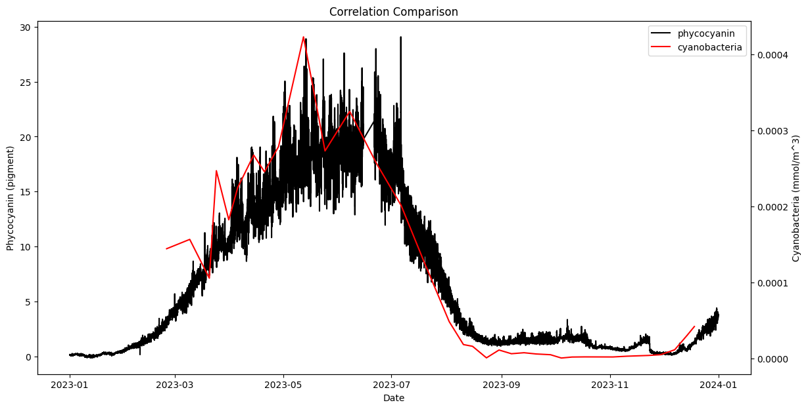

# MARVL Conversion (Phytoplankton Biomass)

| Name | MASTER KEY Variable ID | Units | Model_TFV Variable ID | Model_TFV Variable Name | Model_TFV TFV Variable Name |
| ------------- | ------------- | ------------- | ------------- | ------------- | ------------- |
| Chlorophyte | var00753 + (var00636 + ... + var00677) | cells/mL --(x275)--> mmol/m3 | var00038 | Phytoplankton Biomass (greens) | WQ_PHY_GRN |
| Picoplankton | var00694 + var00695 + var00710 + var00713 + var00756 | cells/mL --(x275)--> mmol/m3 | var00039 | Phytoplankton Biomass (crypt) | WQ_PHY_CRYPT | BGA
| Diatom (Bacillariophyta) | (var00609 + ... + var00622) | cells/mL --(x200000)--> mmol/m3 | var00040 | Phytoplankton Biomass (diatom) | WQ_PHY_DIATOM | DIAT
| Dolichospermum | var00699 | cells/mL --(x3250)--> mmol/m3 | var00041 | Phytoplankton Biomass (dino) | WQ_PHY_DINO | DOLI
| Cyanobacteria | var00039 + var00041 | mmol/m3 | var00777 | Phytoplankton Biomass (cyano) | WQ_PHY_CYANO | 

---

### Correlation between phycocyanin and cyanobacteria (Dolichospermum + Picoplankton)

---

