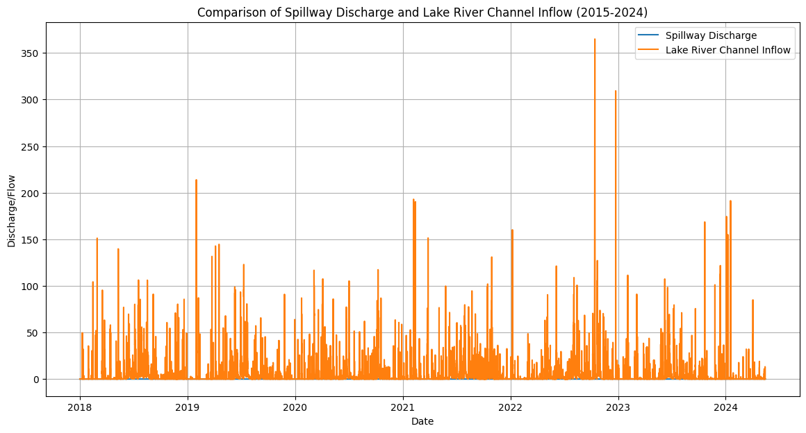
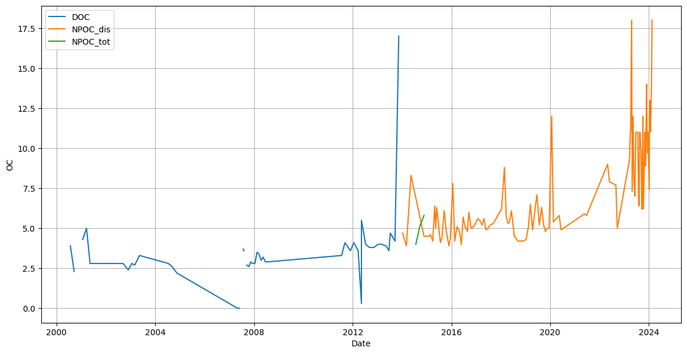

# Inflow Data Processing

### Data Extraction
A comparison plot (flow_comparison.png) has been generated from 

- data-lake/HT/Hydrology/Arthurs Lake Spillway (418.1)/Inflow.csv; and
- data-lake/HT/Hydrology/Arthurs Lake Spillway (418.1)/SpillwayDischarge.csv

to compare the data validity of both data files.

Thus, the Inflow was used as the flow rate for the output file (inflow_woods_dam_20170908-20240514.csv).

Temperature, salinity, and chlorophyll-a data were extracted from continuous data (data-lake/HT/Hydrology/Arthurs Lake Spillway (418.1)/WQ at Morass Bay (418.24)/Continuous/).

Other water qualities (including total suspended solid, ammonium, nitrate, dissolved oxygen, filtered reactive phosphorus, total nitrogen, and total phosphorus) were extracted from samples data (data-warehouse/csv/ht/alwq/).

---

### Data Transformation
Raw data were extracted and linearly interpolated into a 15-minute interval within the timeframe, based on the data availability of flow, temperature, and salinity.

Unavailable data outside this time frame for the water qualities were then extrapolated, using the mean of the available data within the time frame.

**Unit conversion for water qualities** (except total suspended solids):
| Variable | Previous unit | Conversion factor | Current unit |
| ------------- | ------------- | ------------- | ------------- |
| Dissolved oxygen | mg O2/L | 1/32 | mmol O2/m3 |
| Ammonium | mg N/L | 1/14 | mmol N/m3 |
| Nitrate | mg N/L | 1/14 | mmol N/m3 |
| Filtered reactive phosphorus | mg P/L | 1/31 | mmol P/m3 |
| Organic carbon | mg C/L | 1/12 | mmol C/m3 |
| Organic nitrogen | mg N/L | 1/14 | mmol N/m3 |
| Organic phosphorus | mg P/L | 1/31 | mmol P/m3 |
| Chlorophyll-a | ug C55H72O5N4Mg/L | 1/(1000*893.51) | mmol C55H72O5N4Mg/m3 |

**Calculation of organic nitrogen and organic phosphorus:**

Organic nitrogen = Total nitrogen - Nitrate - Ammonium

Organic phosphorus = Total phosphorus - Filtered reactive phosphorus

**Assumptions:**

Organic carbon is the observed mean of dissolved organic carbon, dissolved organic carbon non-purgeable, and total organic carbon non-purgeable of Woods Lake (refer to Woods POC DOC.png).

---

### Output File Format
| Date  | FLOW | TEMP | SAL | CHLA | SS | NH4 | NO3 | OXY | FRP | ON | OP | OC | ZEROS | ONES |
| ------------- | ------------- | ------------- | ------------- | ------------- | ------------- | ------------- | ------------- | ------------- | ------------- | ------------- | ------------- | ------------- | ------------- | ------------- |
| dd/mm/yyyy HH:MM:SS | Inflow | Water temperature | Salinity | Chlorophyll-a | Total Suspended Solids | Ammonium | Nitrate | Dissolved Oxygen | Filtered Reactive Phosphorus | Organic nitrogen | Organic phosphorus | Organic carbon | 0s | 1s |

---

### File Description
| Format  | Name  | Description  |
| ------------- | ------------- | ------------- |
| .csv  | Interpolated_418.1_ArthursInflow.csv | Interpolated inflow |
| .csv  | Interpolated_418.1_ArthursSpillway.csv | Interpolated spillway flow |
| .csv  | inflow_woods_dam_20170908-20240614.csv | Interpolated inflow of Woods Lake |
| .ipynb  | comparison_plot.ipynb | Python script written in Jupyter notebook for plotting comparison graph|
| .ipynb  | inflow_processing.ipynb | Python script written in Jupyter notebook for processing inflow data|
| .ipynb  | all_inflow_processing.ipynb | Python script written in Jupyter notebook for processing Woods lake inflow|
| .ipynb  | spillway_processing.ipynb | Python script written in Jupyter notebook for processing spillway data|
| .png  | flow_comparison.png | Comparison plot between the flow of inflow and spillway |
| .png  | Woods POC DOC.png | Comparison plot of dissolved organic carbon, dissolved organic carbon non-purgeable, and total organic carbon non-purgeable of Woods Lake |

---

## Process data and header files
**Assumptions:**
The unit of discharge is assumed to be m3/s, not mentioned in raw datasets.

### Output File Format
**Data file:**
| Variable  | Date | Depth | Data | QC |
| ------------- | ------------- | ------------- | ------------- | ------------- |
| variable name | yyyy-mm-dd HH:MM:SS | lake depth | variable value | quality control |

**Header file:**
| Header | Value |
| ------------- | ------------- |
| Agency Name | Hydro Tasmania |
| Agency Code | HT |
| Program | Arthurs Lake WQ |
| Project | ALWQ |
| Tag | HT-ALWQ |
| Data File Name | Raw data source file (.csv) |
| Location | Raw data source location (file path) |
| Station Status | Active |
| Lat | Latitude (dam/middle of the lake) |
| Long | Longitude (dam/middle of the lake) |
| Time Zone | GMT +6 |
| Vertical Datum | mAHD |
| National Station ID | 418 |
| Site Description | 418 |
| Deployment | profile |
| Deployment position | m from surface |
| Vertial Reference | Water Surface |
| Site Mean Depth | - |
| Bad or Unavailable Data Value | NaN |
| Contact Email | - |
| Variable ID | standardised mapping key |
| Data Category | standardised mapping variable category |
| Sampling Rate (min) | - |
| Date | yyyy-mm-dd HH:MM:SS |
| Depth | decimal |
| Variable | variable name in raw data |
| QC | int |

### Data Sources
**Arthurs Lake (data-warehouse/csv/ht/alwq) from:**
| Variables | Source |
| ------------- | ------------- |
| Samples | *data-lake/HT/Hydrology/Arthurs Lake Spillway (418.1)/Inflow.csv* |
| Samples | *data-lake/HT/Hydrology/Arthurs Lake Spillway (418.1)/SpillwayDischarge.csv* |